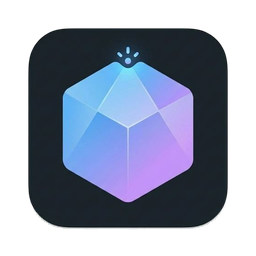
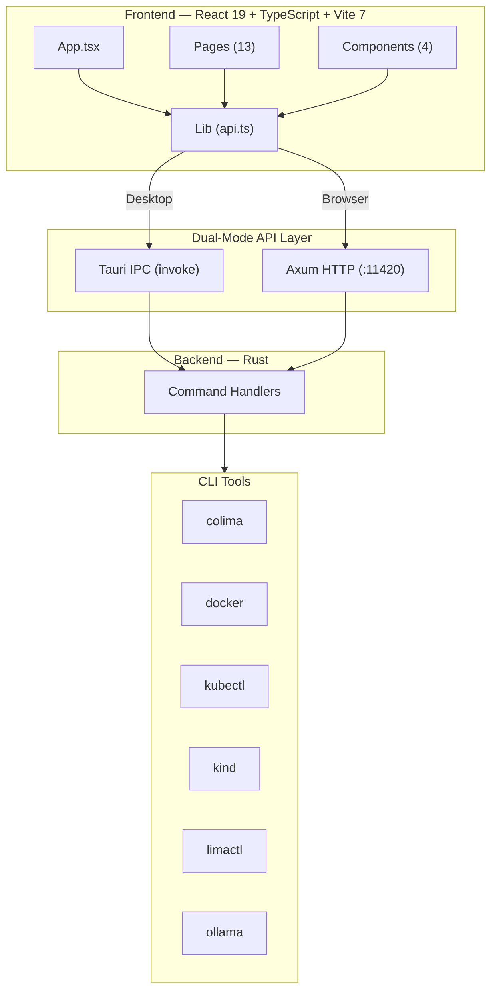

<p align="center">
  
</p>

<h1 align="center">ColimaUI</h1>

<p align="center">
  A modern, feature-rich desktop & web GUI for <a href="https://github.com/abiosoft/colima">Colima</a> — manage Docker containers, Kubernetes clusters, Linux VMs, and more from a beautiful dark-themed interface.
</p>

<p align="center">
  
  
  
  
  
</p>

---

## ✨ Features

### 🐳 Docker Management
- **Containers** — List, start, stop, restart, pause, unpause, remove, rename. View logs, inspect details, see real-time stats (CPU/Memory/Network/IO), run new containers with full configuration
- **Images** — Pull, remove, prune unused, inspect, tag. Batch operations supported
- **Volumes** — Create, inspect, remove, prune. View mount details and usage
- **Networks** — Create (bridge/overlay/macvlan/host), inspect, remove, prune
- **Docker Compose** — List projects, view services, restart/stop projects, view logs

### ☸️ Kubernetes
- **Multi-resource browser** — Pods, Deployments, Services, ConfigMaps, Secrets, StatefulSets, DaemonSets, Jobs, CronJobs, Ingresses, PVCs, Namespaces, Nodes, Events
- **Resource actions** — Describe, view/edit YAML, view logs (with container selection), delete, restart, scale replicas
- **Port forwarding** — Create and manage port forwards to services and pods
- **Exec** — Shell into pod containers
- **Cluster health** — Health scan dashboard with node status, resource pressure, component health
- **Context switching** — Switch between multiple Kubernetes contexts
- **Kind clusters** — Create and manage [Kind](https://kind.sigs.k8s.io/) clusters

### 🖥️ Linux VMs (Lima)
- Create VMs from templates with custom CPU, memory, and disk settings
- Start, stop, delete VMs
- Shell into VMs directly

### 🤖 AI Features
- **Dockerfile Generator** — Choose from templates (Node.js, Python, Go, Rust, Java, Ruby, .NET) and edit interactively
- **AI Chat** — Chat with AI to generate/optimize Dockerfiles. Supports multiple providers:
  - Anthropic (Claude)
  - OpenAI (GPT)
  - Google (Gemini)
  - Ollama (local models)
  - OpenRouter, Groq, Together AI, Mistral, DeepSeek, and more
- **AI Models** — Pull, delete, and serve Ollama models directly

### 📊 Dashboard
- System overview with running/stopped instance counts, total CPU/memory allocation
- Docker resource counts (containers, images, volumes, networks, compose projects)
- Kubernetes status (connection, pod/namespace counts, Kind clusters)
- Linux VM status (total/running counts)
- Clickable cards for quick navigation

### 🔧 Additional Features
- **Terminal** — Integrated xterm.js terminal with SSH into Colima instances or Lima VMs
- **Instance Management** — Create/start/stop/delete Colima instances with full configuration (runtime, CPU, memory, disk, VM type, architecture, mounts, DNS, K3s)
- **Setup Wizard** — First-run guided setup for installing dependencies
- **Getting Started Tour** — Interactive walkthrough for new users
- **Global Toast Notifications** — Persistent notifications across tab switches for long-running operations
- **System Settings** — View installed dependencies, disk usage, system prune

---

## 🏗️ Architecture

ColimaUI uses a **dual-mode architecture** that works as both a native desktop app and a web application:



### Frontend (`src/`)

| Directory | Contents |
|-----------|----------|
| `pages/` | 13 page components (Dashboard, Instances, Containers, Images, Volumes, Networks, Compose, Kubernetes, LinuxVMs, Models, DockerfileGen, Terminal, Settings) |
| `components/` | Shared components (ConfirmDialog, SetupWizard, GettingStartedTour, Icons) |
| `lib/` | API layer (`api.ts`) with dual-mode Tauri/HTTP support, global toast system (`globalToast.ts`) |
| `assets/` | Static assets |

### Backend (`src-tauri/`)

| File | Purpose |
|------|---------|
| `lib.rs` | Tauri app setup, plugin registration, IPC command handlers |
| `api_server.rs` | Axum HTTP API server (port 11420) for browser-mode access |
| `commands/` | Modular command handlers: `colima`, `docker`, `volumes`, `networks`, `compose`, `kubernetes`, `lima`, `models`, `ai_chat`, `system` |
| `instance_reader.rs` | Colima instance YAML config parser |
| `terminal_session.rs` | PTY-based terminal session management for xterm.js |
| `poller.rs` | Background instance status poller |
| `path_util.rs` | PATH fixup for macOS Finder/Dock launches |

---

## 📦 Prerequisites

- **macOS** (primary platform)
- **[Colima](https://github.com/abiosoft/colima)** — Container runtime manager
- **[Docker CLI](https://docs.docker.com/engine/install/)** — Container engine client
- **[Lima](https://lima-vm.io/)** — Linux VM manager (installed with Colima)
- **[Node.js](https://nodejs.org/) ≥ 18** — For frontend development
- **[Rust](https://www.rust-lang.org/tools/install)** — For Tauri backend
- **[kubectl](https://kubernetes.io/docs/tasks/tools/)** *(optional)* — For Kubernetes features
- **[Kind](https://kind.sigs.k8s.io/)** *(optional)* — For Kind cluster management
- **[Ollama](https://ollama.ai/)** *(optional)* — For local AI model management

---

## 🚀 Getting Started

### 1. Clone the repository

```bash
git clone https://github.com/vnknowledge2014/colima-ui.git
cd colima-ui
```

### 2. Install dependencies

```bash
npm install
```

### 3. Run in development mode

#### Desktop App (Tauri)

```bash
npm run tauri dev
```

This starts both the Vite dev server (port 1420) and the Tauri native window.

#### Web-only (Browser)

```bash
npm run dev
```

Then open `http://localhost:1420` in your browser. The app will use HTTP API on port 11420 (requires the Tauri backend to be running, or a standalone API server).

### 4. Build for production

#### Desktop App

```bash
npm run tauri build
```

Produces a native `.app` bundle in `src-tauri/target/release/bundle/`.

#### Web-only

```bash
npm run build
```

Output goes to `dist/`.

---

## 🛠️ Tech Stack

| Layer | Technology | Version |
|-------|-----------|---------|
| **Frontend** | React | 19.1 |
| **Language** | TypeScript | 5.8 |
| **Bundler** | Vite | 7.x |
| **Desktop** | Tauri | 2.x |
| **Backend** | Rust (Edition 2021) | — |
| **HTTP Server** | Axum | 0.8 |
| **Terminal** | xterm.js | 6.0 |
| **Styling** | Vanilla CSS (dark theme) | — |

### Key Dependencies

**Frontend:**
- `@tauri-apps/api` — Tauri IPC bridge
- `@tauri-apps/plugin-shell` — Shell command execution
- `@xterm/xterm` + `@xterm/addon-fit` + `@xterm/addon-web-links` — Terminal emulation

**Backend (Rust):**
- `tauri` (with `tray-icon` feature) — Desktop framework
- `axum` + `tower-http` (CORS) — HTTP API server
- `tokio` — Async runtime
- `serde` + `serde_json` + `serde_yaml` — Serialization
- `tauri-plugin-shell` — Shell command execution from Tauri

---

## 📁 Project Structure

```
colima-ui/
├── src/                        # Frontend source
│   ├── App.tsx                 # Main app shell, sidebar navigation, global toast
│   ├── main.tsx                # React entry point
│   ├── index.css               # Global styles (dark theme, animations)
│   ├── pages/                  # Page components
│   │   ├── Dashboard.tsx       # System overview & resource counts
│   │   ├── Instances.tsx       # Colima instance & Kind cluster management
│   │   ├── Containers.tsx      # Docker container management
│   │   ├── Images.tsx          # Docker image management
│   │   ├── Volumes.tsx         # Docker volume management
│   │   ├── Networks.tsx        # Docker network management
│   │   ├── Compose.tsx         # Docker Compose project management
│   │   ├── Kubernetes.tsx      # Kubernetes resource browser & actions
│   │   ├── LinuxVMs.tsx        # Lima VM management
│   │   ├── Models.tsx          # Ollama AI model management
│   │   ├── DockerfileGen.tsx   # AI-powered Dockerfile generator
│   │   ├── Terminal.tsx        # Integrated terminal (xterm.js)
│   │   └── Settings.tsx        # System info, disk usage, prune
│   ├── components/             # Shared components
│   │   ├── ConfirmDialog.tsx   # Reusable confirmation dialog
│   │   ├── SetupWizard.tsx     # First-run setup wizard
│   │   ├── GettingStartedTour.tsx  # Interactive tour
│   │   └── Icons.tsx           # SVG icon components
│   └── lib/                    # Utilities
│       ├── api.ts              # Dual-mode API layer (Tauri IPC / HTTP)
│       └── globalToast.ts      # Global toast notification system
├── src-tauri/                  # Tauri backend (Rust)
│   ├── src/
│   │   ├── lib.rs              # App setup & command registration
│   │   ├── main.rs             # Entry point
│   │   ├── api_server.rs       # Axum HTTP API (port 11420)
│   │   ├── commands/           # Modular command handlers
│   │   ├── instance_reader.rs  # Colima config parser
│   │   ├── terminal_session.rs # PTY terminal management
│   │   ├── poller.rs           # Background status polling
│   │   └── path_util.rs        # macOS PATH fixup
│   ├── tauri.conf.json         # Tauri configuration
│   ├── Cargo.toml              # Rust dependencies
│   └── icons/                  # App icons
├── package.json                # Node.js dependencies & scripts
├── vite.config.ts              # Vite configuration (port 1420)
├── tsconfig.json               # TypeScript configuration
└── index.html                  # HTML entry point
```

---

## 🎨 Design

ColimaUI features a premium **dark theme** with:
- Glassmorphism effects and subtle transparency
- Smooth micro-animations and transitions
- Custom CSS variables for consistent theming
- Responsive layout with collapsible sidebar
- macOS-native title bar integration (overlay style)
- Global toast notifications with slide-in animation

---

## 📝 Scripts

| Command | Description |
|---------|-------------|
| `npm run dev` | Start Vite dev server (port 1420) |
| `npm run build` | TypeScript check + Vite production build |
| `npm run preview` | Preview production build |
| `npm run tauri dev` | Start Tauri desktop app in dev mode |
| `npm run tauri build` | Build Tauri desktop app for production |

---

## 🤝 Contributing

1. Fork the repository
2. Create a feature branch (`git checkout -b feature/amazing-feature`)
3. Commit your changes (`git commit -m 'feat: add amazing feature'`)
4. Push to the branch (`git push origin feature/amazing-feature`)
5. Open a Pull Request

Please follow [Conventional Commits](https://www.conventionalcommits.org/) for commit messages.

---

## 📄 License

MIT License. This project is part of the [Colima](https://github.com/abiosoft/colima) ecosystem.

---

<p align="center">
  Built with ❤️ using <a href="https://tauri.app">Tauri</a>, <a href="https://react.dev">React</a>, and <a href="https://www.rust-lang.org">Rust</a>
</p>
