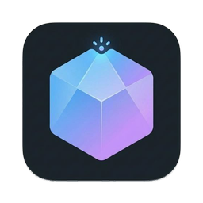

<p align="center">
  
</p>

<h1 align="center">ColimaUI</h1>

<p align="center">
  A modern desktop & web GUI for <a href="https://github.com/abiosoft/colima">Colima</a> — manage Docker containers, Kubernetes clusters, Linux VMs, and AI models from a beautiful dark-themed interface.
</p>

<p align="center">
  <a href="https://github.com/vnknowledge2014/colima-ui/releases/latest"></a>
  <a href="https://github.com/vnknowledge2014/colima-ui/actions/workflows/ci.yml"></a>
  
  
  
  
  <a href="https://github.com/vnknowledge2014/colima-ui/blob/main/LICENSE"></a>
</p>

---

## 📥 Download

Grab the latest release from [**GitHub Releases**](https://github.com/vnknowledge2014/colima-ui/releases/latest):

| Platform | File | Architecture |
|----------|------|--------------| 
| **macOS** (Apple Silicon) | `ColimaUI_*_aarch64.dmg` | M1 / M2 / M3 / M4 |
| **macOS** (Intel) | `ColimaUI_*_x64.dmg` | x86_64 |
| **Linux** (Debian/Ubuntu) | `ColimaUI_*_amd64.deb` | x86_64 |
| **Linux** (Universal) | `ColimaUI_*_amd64.AppImage` | x86_64 |

> **Browser mode:** After launching the app, access the full web UI at `http://127.0.0.1:11420` from any browser.

---

## ✨ Features

### 🐳 Docker Management
- **Containers** — List, start, stop, restart, pause, unpause, remove, rename, inspect, exec, view real-time stats and logs
- **Images** — Pull, remove, prune, inspect, tag with batch operations
- **Volumes** — Create, inspect, remove, prune
- **Networks** — Create (bridge/overlay/macvlan/host), inspect, remove, prune
- **Docker Compose** — List projects, view services, restart/stop projects, view logs

### ☸️ Kubernetes
- **Multi-resource browser** — Pods, Deployments, Services, ConfigMaps, Secrets, StatefulSets, DaemonSets, Jobs, CronJobs, Ingresses, PVCs, Namespaces, Nodes, Events
- **CRD discovery** — Dynamically browse custom resources in the sidebar
- **Resource actions** — Describe, view/edit YAML, view logs, delete, restart, scale
- **Real-time log streaming** — Follow pod logs via SSE with auto-scroll
- **HTTP Benchmark** — Benchmark K8s services with configurable concurrency and latency statistics (p50/p95/p99)
- **Port forwarding** — Create and manage port forwards to services and pods
- **Exec** — Shell into pod containers
- **Cluster health** — Node status, resource pressure, component health
- **Context switching** — Switch between multiple kubeconfig contexts
- **Kind clusters** — Create and manage [Kind](https://kind.sigs.k8s.io/) clusters

### 🖥️ Linux VMs (Lima)
- Create VMs from templates with custom CPU, memory, and disk settings
- Start, stop, delete VMs; shell into VMs directly

### 🤖 AI Diagnostic Agent
- **Self-learning AI** — Expert-level troubleshooting for Colima/Lima/Docker/Kubernetes errors
- **5-tool agent loop** — Web search, page fetch, diagnostic log collection, safe command execution, user-approved commands
- **Knowledge Bank** — SQLite-backed memory (`~/.colima-ui/knowledge.db`) with 22+ builtin solutions, user feedback via 👍/👎
- **3-tier command sandbox** — Safe (auto-run), Approve (user click), Banned (Rust-level block). Prevents destructive commands even if AI hallucinates
- **Multi-provider AI Chat** — Anthropic, OpenAI, Google, Ollama, OpenRouter, Groq, Together AI, Mistral, DeepSeek
- **AI Models** — Pull, delete, and serve Ollama models directly

### 📊 Dashboard & UI
- System overview with running/stopped counts, CPU/memory allocation
- Integrated xterm.js terminal with SSH into instances
- Setup Wizard & Getting Started Tour for new users
- Dark theme with glassmorphism effects and micro-animations
- Context menus, keyboard shortcuts, global toast notifications
- i18n support (English, Vietnamese, Chinese)

---

## 🚀 Getting Started

### Prerequisites

- **[Colima](https://github.com/abiosoft/colima)** — Container runtime manager
- **[Docker CLI](https://docs.docker.com/engine/install/)** — Container engine client
- **[Node.js](https://nodejs.org/) ≥ 18** — Frontend build
- **[Rust](https://www.rust-lang.org/tools/install)** — Backend build
- **[kubectl](https://kubernetes.io/docs/tasks/tools/)** *(optional)* — Kubernetes features
- **[Kind](https://kind.sigs.k8s.io/)** *(optional)* — Kind cluster management
- **[Ollama](https://ollama.ai/)** *(optional)* — Local AI model management

### Development

```bash
git clone https://github.com/vnknowledge2014/colima-ui.git
cd colima-ui
npm install

# Desktop app (Tauri native window + Vite dev server)
npm run tauri dev

# Web-only (frontend at http://localhost:1420)
npm run dev
```

### Production Build

```bash
# Desktop app → src-tauri/target/release/bundle/
npm run tauri build

# Web-only → dist/
npm run build
```

---

## 🛠️ Tech Stack

| Layer | Technology | Version |
|-------|-----------|---------|
| **Frontend** | Svelte 5 (Runes) | 5.56 |
| **Language** | TypeScript | 5.8 |
| **Bundler** | Vite | 8.x |
| **Desktop** | Tauri | 2.x |
| **Backend** | Rust (Edition 2021) | — |
| **HTTP Server** | Axum | 0.8 |
| **Docker Client** | Bollard | 0.18 |
| **Terminal** | xterm.js | 6.0 |
| **Database** | SQLite (rusqlite) | — |
| **Styling** | Vanilla CSS (dark theme) | — |

---

## 📁 Project Structure

```
colima-ui/
├── src/                          # Frontend (Svelte 5 + TypeScript)
│   ├── App.svelte                # Main shell, sidebar, event listeners
│   ├── main.ts                   # Entry point
│   ├── pages/                    # 16 page components
│   ├── components/               # 8 shared components
│   ├── store/                    # Svelte 5 rune-based state
│   ├── lib/                      # API layer, AI bus, i18n, utilities
│   ├── styles/                   # CSS design system (tokens, reset, layout, ...)
│   └── locales/                  # i18n (en, vi, zh)
├── src-tauri/                    # Backend (Rust + Tauri)
│   ├── src/
│   │   ├── lib.rs                # App setup & command registration
│   │   ├── api_server.rs         # Axum router & HTTP server (port 11420)
│   │   ├── commands/             # 14 command modules (business logic)
│   │   ├── routes/               # 14 HTTP route modules (thin delegation)
│   │   ├── adapters/             # Unified DevOps adapter traits
│   │   ├── services/             # High-level service layer
│   │   ├── auth.rs               # API token & auth middleware
│   │   ├── sse.rs                # SSE broadcast & event watchers
│   │   ├── validation.rs         # Security validation (shell injection, etc.)
│   │   ├── helpers.rs            # Response wrappers, CLI runner, caching
│   │   ├── platform.rs           # OS/arch/package manager detection
│   │   ├── docker_state.rs       # Bollard event stream for push updates
│   │   ├── instance_reader.rs    # Colima config YAML parser
│   │   ├── terminal_session.rs   # PTY session management
│   │   └── poller.rs             # Background instance poller
│   └── tauri.conf.json           # Tauri configuration
├── scripts/release.sh            # Automated version bump + tag + push
├── docs/                         # Technical documentation
└── external_skill/               # AI orchestration skill for external agents
```

> See [`docs/`](docs/) for detailed technical documentation.

---

## 🔄 CI/CD & Releases

- **CI** (`.github/workflows/ci.yml`) — TypeScript checking, `cargo check` + `cargo clippy` (macOS ARM64/x86, Linux), frontend build validation
- **Release** (`.github/workflows/release.yml`) — Builds DMG/deb/AppImage on version tags, creates GitHub Release

```bash
# Bump version, commit, tag, and push
./scripts/release.sh patch   # 0.1.1 → 0.1.2
./scripts/release.sh minor   # 0.1.1 → 0.2.0
./scripts/release.sh major   # 0.1.1 → 1.0.0
./scripts/release.sh 2.0.0   # explicit version
```

---

## 🤝 Contributing

1. Fork the repository
2. Create a feature branch (`git checkout -b feature/amazing-feature`)
3. Commit your changes following [Conventional Commits](https://www.conventionalcommits.org/)
4. Push and open a Pull Request

---

## 📄 License

MIT License. Part of the [Colima](https://github.com/abiosoft/colima) ecosystem.

<p align="center">
  Built with ❤️ using <a href="https://tauri.app">Tauri</a>, <a href="https://svelte.dev">Svelte</a>, and <a href="https://www.rust-lang.org">Rust</a>
</p>
