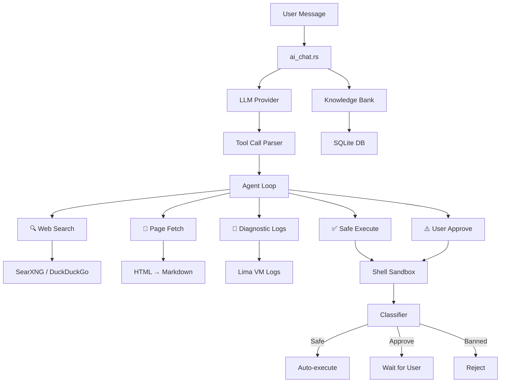

# AI Diagnostic System

ColimaUI includes a self-learning AI diagnostic agent that helps troubleshoot Colima, Lima, Docker, and Kubernetes issues.

## Architecture



## Multi-Provider AI Chat (`commands/ai_chat.rs`)

Supports multiple LLM providers through a unified interface:

| Provider | Models | API |
|----------|--------|-----|
| Anthropic | Claude 3.5, Claude 3 | `api.anthropic.com` |
| OpenAI | GPT-4, GPT-3.5 | `api.openai.com` |
| Google | Gemini Pro, Gemini Flash | `generativelanguage.googleapis.com` |
| Ollama | Any local model | `localhost:11434` |
| OpenRouter | Any model | `openrouter.ai` |
| Groq | Llama, Mixtral | `api.groq.com` |
| Together AI | Various | `api.together.xyz` |
| Mistral | Mistral models | `api.mistral.ai` |
| DeepSeek | DeepSeek models | `api.deepseek.com` |

Configuration is stored in the Knowledge Bank SQLite database and managed via the Settings page.

## 5-Tool Agent Loop (`commands/agent_loop.rs`)

The AI agent has access to 5 tools for autonomous troubleshooting:

### 1. Web Search (`commands/searxng.rs`)
- Primary: SearXNG instance (configurable)
- Fallback: DuckDuckGo HTML scraping
- Returns structured search results with titles, URLs, and snippets

### 2. Page Fetch
- Fetches web pages and converts HTML to Markdown
- Uses `scraper` + `html2md` for clean content extraction
- Respects content limits to fit LLM context windows

### 3. Diagnostic Logs (`commands/colima.rs`)
- Collects Lima VM logs: `ha.stderr.log`, `serial.log`
- Detects zombie processes, stale lock/PID/socket files
- Inspects Colima instance YAML configuration

### 4. Safe Command Execution (auto-run)
- Read-only diagnostic commands execute automatically
- Examples: `docker ps`, `colima status`, `cat /var/log/...`, `ps aux`

### 5. User-Approved Execution
- State-changing commands require explicit user approval
- Examples: `colima stop --force`, `pkill qemu`, `rm -f /tmp/...`
- User sees the command and clicks "Approve" or "Reject"

## Command Sandbox (`commands/shell_sandbox.rs`)

Three-tier safety classification:

### Tier 1: Safe (Auto-execute)
Commands that only read state:
```
ps, cat, ls, df, du, free, uptime, whoami, hostname,
docker ps, docker images, docker logs, docker inspect,
colima status, kubectl get, limactl list, ...
```

### Tier 2: Approve (User confirmation required)
Commands that modify state:
```
docker stop, docker rm, colima stop, colima delete,
pkill, kill, rm (specific files), ...
```

### Tier 3: Banned (Rejected at Rust level)
Commands that are always blocked, even if AI requests them:
```
sudo, su, eval, exec, rm -rf /, shutdown, reboot,
mkfs, dd, format, curl | sh, wget | sh, ...
```

## Knowledge Bank (`commands/knowledge_bank.rs`)

SQLite-backed memory at `~/.colima-ui/knowledge.db`:

### Schema

```sql
-- Builtin solutions (22+ pre-loaded)
CREATE TABLE solutions (
    id INTEGER PRIMARY KEY,
    error_pattern TEXT,
    solution TEXT,
    category TEXT,
    upvotes INTEGER DEFAULT 0,
    downvotes INTEGER DEFAULT 0
);

-- User memories (custom knowledge)
CREATE TABLE memories (
    id INTEGER PRIMARY KEY,
    content TEXT,
    category TEXT,
    created_at TEXT,
    updated_at TEXT
);

-- Anti-patterns (solutions marked as bad by user)
CREATE TABLE anti_patterns (
    id INTEGER PRIMARY KEY,
    pattern TEXT,
    reason TEXT
);

-- Settings (AI provider config, preferences)
CREATE TABLE settings (
    key TEXT PRIMARY KEY,
    value TEXT
);

-- Presets (instance configuration presets)
CREATE TABLE presets (
    id INTEGER PRIMARY KEY,
    name TEXT,
    config TEXT
);
```

### Feedback Loop

1. AI proposes a solution
2. User clicks 👍 → Solution saved to `solutions` with upvote
3. User clicks 👎 → Pattern saved to `anti_patterns` so AI avoids it in future
4. On next similar error, AI queries knowledge bank first before web search

### Commands

| Function | Purpose |
|----------|---------|
| `kb_query(error)` | Find matching solutions for an error pattern |
| `kb_learn(error, solution)` | Save a new solution |
| `kb_feedback(id, positive)` | Upvote or downvote a solution |
| `kb_save_anti_pattern(pattern, reason)` | Record what doesn't work |
| `add_memory(content, category)` | Save custom knowledge |
| `search_memory(query)` | Search memories by text |

## Frontend Integration

### AI Chat Panel (`components/AiChatPanel.svelte`)
- Chat interface with message history
- Tool execution visualization (search results, command output)
- Inline approve/reject buttons for sandbox commands
- 👍/👎 feedback buttons on AI responses
- Provider/model selection in settings

### AI Event Bus (`lib/aiEvents/`)
- Domain-specific tool registrations for each area (Docker, K8s, Colima, Lima, etc.)
- Allows AI to invoke UI actions (navigate to page, refresh data, etc.)

### AI Tool Parser (`lib/aiToolParser.ts`)
- Parses XML-style tool calls from LLM responses
- Extracts tool name, parameters, and result expectations

## External Agent Integration

ColimaUI can be orchestrated by external AI agents via the headless CLI chat endpoint:

```bash
curl -H "Authorization: Bearer <TOKEN>" \
     -X POST http://127.0.0.1:11420/api/cli/chat \
     -d '{"prompt": "Check if any containers are exited and remove them"}'
```

The external agent skill is defined in `external_skill/SKILL.md` with full API documentation.
