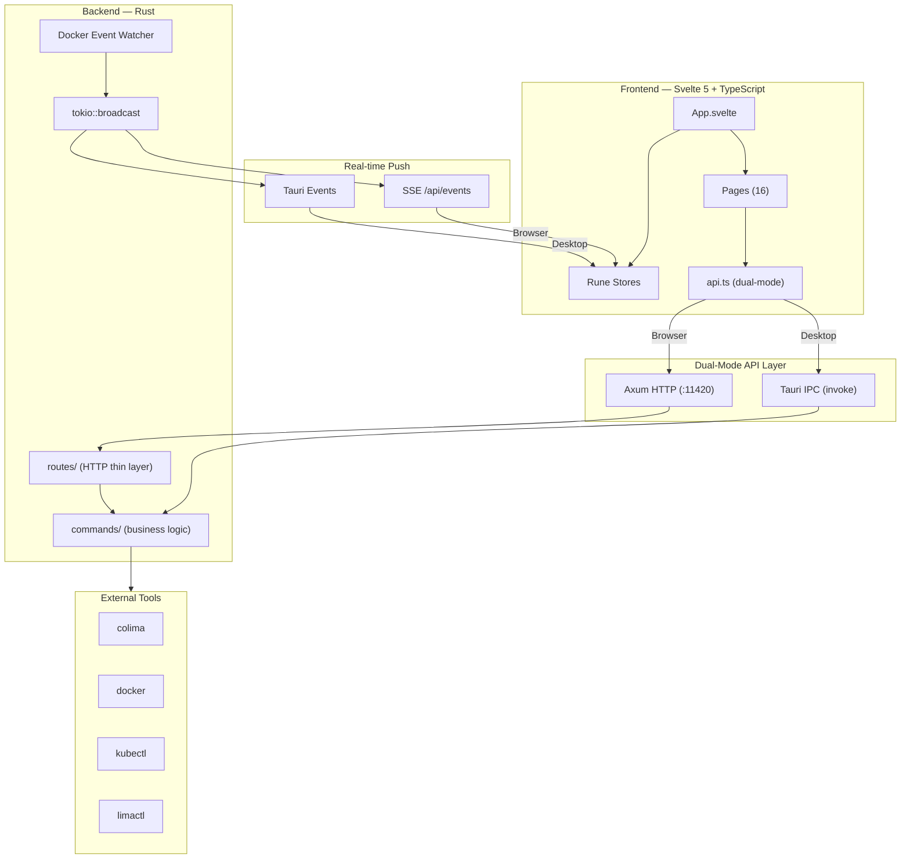

# Architecture

ColimaUI uses a **dual-mode, event-driven architecture** that works as both a native desktop app and a browser-based web application, sharing the same Rust backend.

## High-Level Overview



## Dual-Mode Design

The frontend detects whether it's running inside Tauri (native) or a browser:

```typescript
// src/lib/api.ts
const IS_TAURI = '__TAURI_IPC__' in window;

// Desktop mode: Tauri IPC (invoke)
// Browser mode: HTTP fetch to localhost:11420
```

This allows **one codebase** to serve both modes without conditional branches in page components.

## Event-Driven Updates

| Mode | Push Mechanism | Fallback |
|------|---------------|----------|
| **Desktop** | Tauri IPC events (`instances-update`, `docker-state-updated`) | — |
| **Browser** | `EventSource` → `/api/events` (SSE) | HTTP polling (3–5s) |

The backend uses `tokio::broadcast` channels to fan-out events to both Tauri events and SSE simultaneously.

## Request Flow

### Desktop Mode
```
User Action → Svelte Component → api.ts → tauri.invoke() → lib.rs → commands/*.rs → CLI tool → Response
```

### Browser Mode
```
User Action → Svelte Component → api.ts → fetch() → api_server.rs → routes/*.rs → commands/*.rs → CLI tool → Response
```

## Security Architecture

Security validations are applied at the **commands layer** so both entry points (Tauri IPC and HTTP) are protected:

```
┌─────────────────┐     ┌─────────────────┐
│  Tauri IPC       │     │  HTTP Routes     │
│  (invoke)        │     │  (Axum)          │
└────────┬────────┘     └────────┬────────┘
         │                       │
         └──────────┬────────────┘
                    │
         ┌──────────▼──────────┐
         │  commands/*.rs       │
         │  - shell injection   │
         │  - banned flags      │
         │  - container ID      │
         │  - host mount block  │
         └──────────┬──────────┘
                    │
         ┌──────────▼──────────┐
         │  CLI Tools           │
         │  docker / colima /   │
         │  kubectl / limactl   │
         └─────────────────────┘
```

### Validation Rules (validation.rs)

| Check | Function | Protects |
|-------|----------|----------|
| Shell injection | `contains_shell_injection()` | `container_exec`, `lima_shell` |
| Container ID format | `is_valid_container_id()` | Container operations |
| Banned Docker flags | `BANNED_DOCKER_FLAGS` | `run_container` (blocks `--privileged`, `--pid=host`, etc.) |
| Host root bind mount | Inline check | `run_container` (blocks `source=/` bind mounts) |
| K8s name format | `is_valid_k8s_name()` | Lima VM names |

## HTTP Authentication

The HTTP API uses **Bearer token** authentication:

1. Token is auto-generated at startup (random UUID)
2. Browser clients obtain it via `GET /api/auth/token` (CORS-protected to localhost origins only)
3. All other endpoints require `Authorization: Bearer <token>`
4. The `/api/health` endpoint is unauthenticated (health checks)

## State Management

### Frontend (Svelte 5 Runes)

| Store | File | Contents |
|-------|------|----------|
| Global | `store.svelte.ts` | Instances, containers, images, volumes, networks, compose, system info |
| AI | `store/ai.svelte.ts` | Chat messages, provider config, agent state |
| K8s | `store/k8s.svelte.ts` | Namespaces, pods, deployments, services, CRDs |
| Confirm | `store/confirm.svelte.ts` | Confirmation dialog state |

### Backend (Rust)

| State | Scope | Purpose |
|-------|-------|---------|
| `DockerState` | `tauri::State` (managed) | Bollard client, container/image cache |
| `PollerState` | `tauri::State` (managed) | Background instance poller handle |
| `ResourceSaverState` | `tauri::State` (managed) | Resource saver mode timer |
| `SYSTEM_INFO_CACHE` | `LazyLock<Mutex<TimedCache>>` | Cached system info (colima/docker versions) |
| `SSE_TX` | `LazyLock<broadcast::Sender>` | SSE event broadcaster |
| `API_TOKEN` | `LazyLock<String>` | Random auth token |
| `PORT_FORWARDS` | `LazyLock<Mutex<HashMap>>` | Active K8s port forwards |
