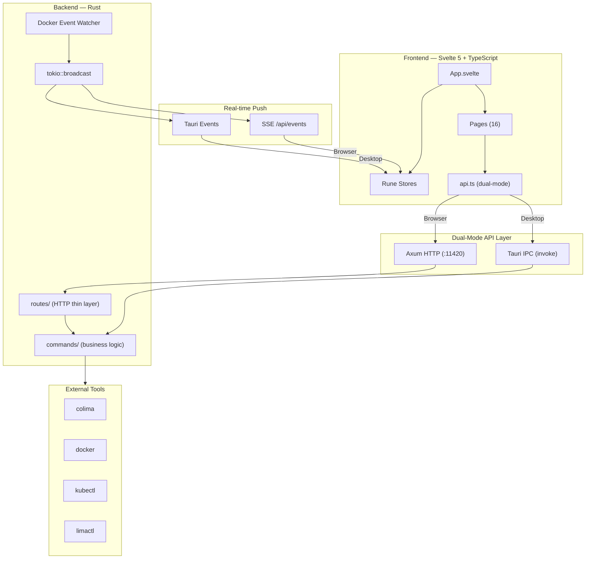

# Architecture

ColimaUI uses a **dual-mode, event-driven architecture** that works as both a native desktop app and a browser-based web application, sharing the same Rust backend.

## High-Level Overview



## Dual-Mode Design

The frontend detects whether it's running inside Tauri (native) or a browser:

```typescript
// src/lib/api.ts
const IS_TAURI = '__TAURI_IPC__' in window;

// Desktop mode: Tauri IPC (invoke)
// Browser mode: HTTP fetch to localhost:11420
```

This allows **one codebase** to serve both modes without conditional branches in page components.

## Event-Driven Updates

| Mode | Push Mechanism | Fallback |
|------|---------------|----------|
| **Desktop** | Tauri IPC events (`instances-update`, `docker-state-updated`) | — |
| **Browser** | `EventSource` → `/api/events` (SSE) | HTTP polling (3–5s) |

The backend uses `tokio::broadcast` channels to fan-out events to both Tauri events and SSE simultaneously.

## Request Flow

### Desktop Mode
```
User Action → Svelte Component → api.ts → tauri.invoke() → lib.rs → commands/*.rs → CLI tool → Response
```

### Browser Mode
```
User Action → Svelte Component → api.ts → fetch() → api_server.rs → routes/*.rs → commands/*.rs → CLI tool → Response
```

## Security Architecture

Security validations are applied at the **commands layer** so both entry points (Tauri IPC and HTTP) are protected:

```
┌─────────────────┐     ┌─────────────────┐
│  Tauri IPC       │     │  HTTP Routes     │
│  (invoke)        │     │  (Axum)          │
└────────┬────────┘     └────────┬────────┘
         │                       │
         └──────────┬────────────┘
                    │
         ┌──────────▼──────────┐
         │  commands/*.rs       │
         │  - shell injection   │
         │  - banned flags      │
         │  - container ID      │
         │  - host mount block  │
         └──────────┬──────────┘
                    │
         ┌──────────▼──────────┐
         │  CLI Tools           │
         │  docker / colima /   │
         │  kubectl / limactl   │
         └─────────────────────┘
```

### Validation Rules (validation.rs)

| Check | Function | Protects |
|-------|----------|----------|
| Shell injection | `contains_shell_injection()` | `container_exec`, `lima_shell` |
| Container ID format | `is_valid_container_id()` | Container operations |
| Banned Docker flags | `BANNED_DOCKER_FLAGS` | `run_container` (blocks `--privileged`, `--pid=host`, etc.) |
| Host root bind mount | Inline check | `run_container` (blocks `source=/` bind mounts) |
| K8s name format | `is_valid_k8s_name()` | Kubernetes resource names |
| Profile name | `is_valid_profile_name()` / `ensure_valid_profile()` | Colima profile arguments — a name starting with `-` would otherwise be read by `colima` as a flag, and the name is also a path component under `~/.colima` |
| Resource name | `is_valid_resource_name()` | Lima VM, volume and network names passed positionally to CLI tools |
| Path containment | `assert_path_within()` | Any filesystem path built from user input; fails closed when the parent cannot be resolved |

### Running CLI Commands

Two paths, sharing their environment setup and "not installed" message via
`helpers::build_cmd` and `helpers::describe_exec_error`:

| Path | Use for | Notes |
|------|---------|-------|
| `helpers::run_cmd` | Short commands | Buffers all stdout in RAM via `Command::output()` |
| `streaming_cmd::run_cmd_streaming` | Long or large output | stdout goes straight to a file or is consumed line by line, so resident memory does not track payload size |

`streaming_cmd` keeps a registry of in-flight commands so they can be cancelled by
id and killed wholesale at `ExitRequested`. Children are spawned into their own
process group and cancelled with a group signal — signalling only the direct child
leaves forked helpers alive, still holding the stderr pipe open.

Path confinement is the caller's responsibility; the per-operation base directory
policy is documented on `validation::assert_path_within`.

### Metrics Collection

`commands/metrics_collector.rs` is the app's only sampling loop. Components read
its output rather than polling Docker themselves, so daemon load does not scale
with the number of open views and every figure on screen comes from one reading.

It has two outputs, and the distinction matters:

| Channel | Mechanism | Guarantee |
|---------|-----------|-----------|
| Display | `publish_sse_event("metrics.sample", …)` | Lossy. A slow client gets `stream-lagged` and draws a gap |
| Durable | `set_metric_writer(…)` | Every batch, delivered directly |

Anything that must not lose samples registers a writer. Reading the SSE stream for
that purpose loses data silently under load.

## Background transfers

Copying files in and out of containers and moving images as TAR archives are the
only operations with a lifecycle: they run for minutes, report progress, and can be
cancelled. Three pieces, deliberately separate:

| Piece | Owns |
|-------|------|
| `streaming_cmd` | The child process. Streams stdout to disk, kills process groups, cleans up |
| `transfer_registry` | What transfers *exist* — status, bytes, and a readable outcome |
| `commands::file_transfer` | Validation, argument construction, and the event payloads |

`streaming_cmd`'s own map is built for killing processes: entries appear when the
child spawns and vanish when it is reaped. That cannot answer "what is going on"
after a webview reload, which is why the registry exists alongside it rather than
inside it. The registry registers a job **before** the process spawns — a spawn
failure emits a terminal event microseconds later, for an id the caller does not
have yet — and keeps terminal entries for about a minute so a client that missed
the event can still read the outcome via `GET /api/transfers`.

Output is written to a `<name>.<job-id>.part` sibling and renamed onto the
destination only on success. Nothing touches the destination until there is a
complete artefact for it, so a cancelled overwrite leaves the file the user already
had. The job id is part of the scratch name because two jobs may legitimately name
one destination.

Failure text is redacted **at the source**, before it is emitted: it leaves the
process on two transports and there is no single downstream place that covers both.
Note the limit — `redact` masks home-directory account segments and known secret
shapes, not arbitrary absolute paths, which is why the OS notification layer sends
only a transfer's name and never this field.

Sampling is gated on `sse::subscriber_count("metrics.sample")`, so an app with no
Activity page open makes no engine calls at all. `MetricSample` carries an
`instance` column from the outset: samples written before multi-engine support
existed would otherwise be an unattributable mix.

Samples come from the **engine API** (bollard), not the `docker` CLI, and the CPU
delta is computed against the previous tick. Measured with 20 containers at a 2 s
period: **0.14% CPU, 2.8 ms per sample**, down from 11.16% and 669 ms via the CLI —
which also could not sustain a 2 s period at all, because one
`docker stats --no-stream` takes about six seconds with 25 containers. The CLI path
remains as a fallback for engines that do not speak the Docker API (`nerdctl` on
containerd).

Engine-wide figures are deliberately absent from the sample stream:
`engine_resources` derives aggregate CPU by running `docker stats`, the most
expensive call this app makes, for a number the collector already holds as a sum.
The Activity page fetches `/api/system/engine-resources` once when it opens.

The collector imports nothing from `pro`/`subscription` — a unit test asserts it —
so the paid build's involvement is one `set_metric_writer` call at startup.

### Secret Redaction

`src-tauri/src/redact.rs` and `src/lib/redact.ts` strip credentials from any
string that reaches the user, a log, or an LLM prompt. Both sides exist because
the frontend calls LLM providers directly, so provider errors are built in the
browser and never pass through Rust.

Redaction works two ways: by **position** (credential-shaped query parameters
and auth headers, whatever the value looks like — this covers providers we have
never heard of) and by **shape** (known key formats anywhere in the string).
Docker image digests are deliberately excluded from the shape rules so
diagnostics stay readable.

On the frontend the choke point is `globalToast()`: it is the last place every
user-visible message passes through, and it also forwards error text to the AI
diagnostics listener — i.e. off to a third-party LLM.

## HTTP Authentication

The HTTP API uses **Bearer token** authentication:

1. Token is auto-generated at startup with a CSPRNG (`auth::get_api_token`)
2. The desktop webview obtains it over IPC (`auth::api_token`). Browser clients receive it out-of-band in a URL fragment (`#token=…`), which the frontend consumes once and strips from the address bar
3. All endpoints require `Authorization: Bearer <token>`, compared in constant time
4. `/api/health` is the only unauthenticated route; the list is explicit in `api_server.rs`, not pattern-matched
5. SSE endpoints authenticate via `?token=` because `EventSource` cannot set headers. The set of such endpoints is an explicit allowlist (`auth::QUERY_TOKEN_PATHS`) — a route is never switched to query-token auth just because its path ends in `/stream`

**No endpoint hands the token out.** `GET /api/auth/token` used to, from the
public router, claiming CORS as its protection — which restricts browsers and
nothing else. Any local process could read the token and then use the entire
API, including `GET /api/settings` and its configured AI key.

The consequence is intended: a browser tab opened by hand has no credential and
no way to obtain one.

**Browser mode is a development surface.** Neither router mounts a `ServeDir`,
so no build serves the frontend over HTTP — the only page that can reach the API
is the vite dev server on 1420, which is why that origin is in the CORS list. So
the handoff is sized to match: a debug build prints the ready-made
`http://localhost:1420/#token=…` URL to stdout when the server binds, and there
is no in-app "open in browser" affordance because there is nothing to open. If a
packaged build ever serves its own frontend, `auth::api_token` is the seam where
a real handoff belongs.

### Accepted risks

One weakness is known and deliberately left in place, because every available
fix costs a feature the product needs. Revisit it if the threat model changes
(e.g. multi-user machines become a target).

| Risk | Why it stays |
|---|---|
| `capabilities/default.json` allows `https://*` | This is what lets the app reach OpenRouter, Groq, Together, Mistral, DeepSeek and user-configured endpoints (custom Ollama, private SearXNG). Tauri capabilities are compile-time, so a narrow list cannot be extended at runtime — narrowing would permanently break 6 of the 9 advertised providers. The fix is to route provider calls through Rust (`reqwest` is not bound by capabilities) |

## State Management

### Frontend (Svelte 5 Runes)

| Store | File | Contents |
|-------|------|----------|
| Global | `store.svelte.ts` | Instances, containers, images, volumes, networks, compose, system info |
| AI | `store/ai.svelte.ts` | Chat messages, provider config, agent state |
| K8s | `store/k8s.svelte.ts` | Namespaces, pods, deployments, services, CRDs |
| Confirm | `store/confirm.svelte.ts` | Confirmation dialog state |

### Backend (Rust)

| State | Scope | Purpose |
|-------|-------|---------|
| `DockerState` | `tauri::State` (managed) | Bollard client, container/image cache |
| `PollerState` | `tauri::State` (managed) | Background instance poller handle |
| `ResourceSaverState` | `tauri::State` (managed) | Resource saver mode timer |
| `SYSTEM_INFO_CACHE` | `LazyLock<Mutex<TimedCache>>` | Cached system info (colima/docker versions) |
| `SSE_TX` | `LazyLock<broadcast::Sender>` | SSE event broadcaster |
| `API_TOKEN` | `LazyLock<String>` | Random auth token |
| `PORT_FORWARDS` | `LazyLock<Mutex<HashMap>>` | Active K8s port forwards |
